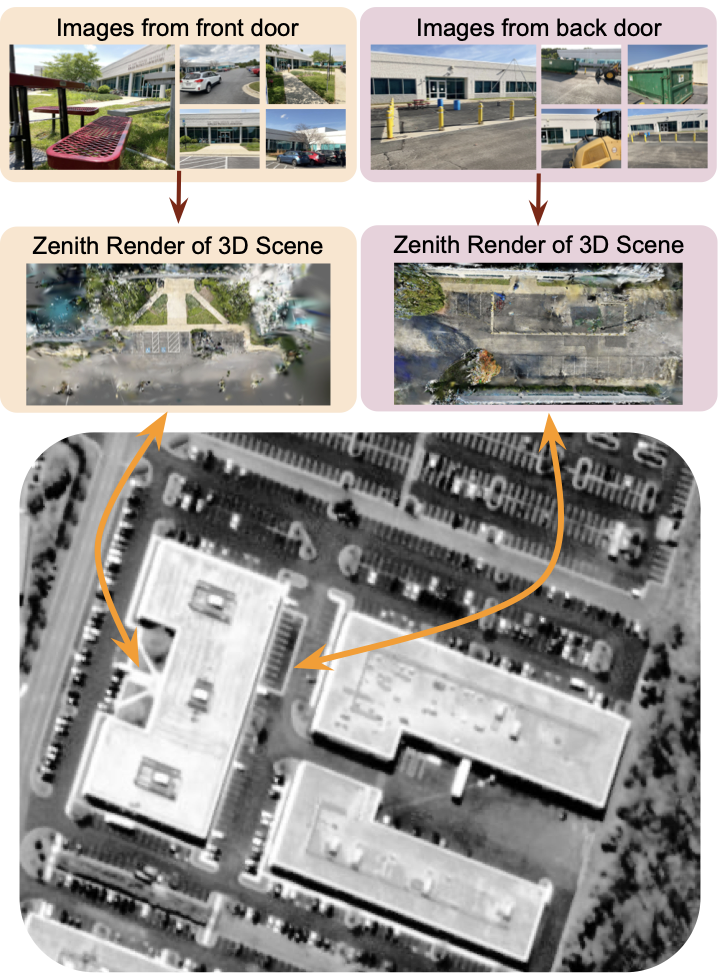
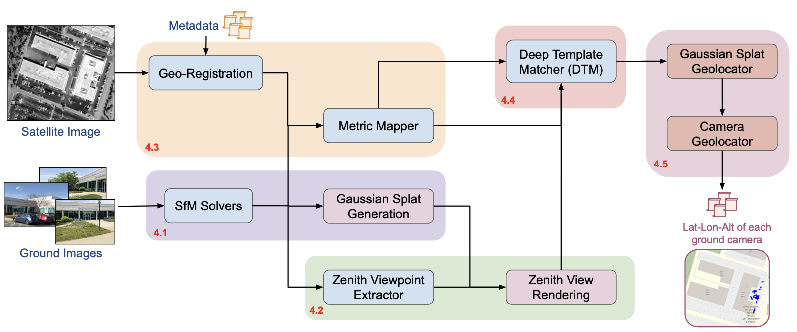
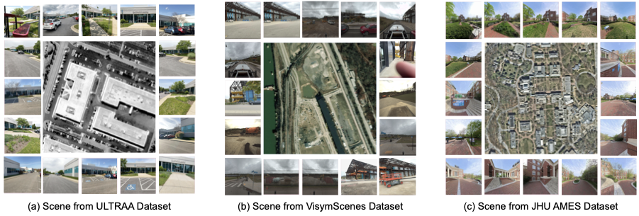
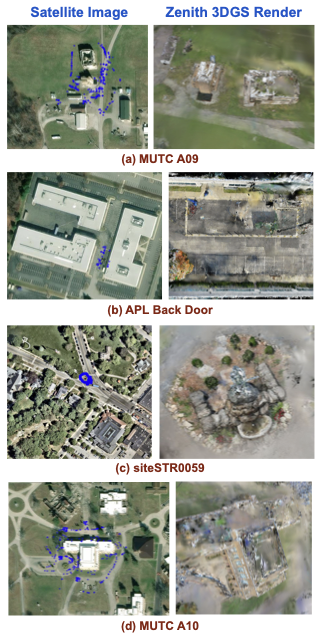

<div align="center">

# *wrivinder*: Towards Spatial Intelligence for Geo-locating Ground Images onto Satellite Imagery

**CVPR 2026**

[Chandrakanth Gudavalli](https://chandrakanthgudavalli.github.io)<sup>1</sup> &nbsp;·&nbsp;
Tajuddin Manhar Mohammed<sup>1</sup> &nbsp;·&nbsp;
Abhay Yadav<sup>2</sup> &nbsp;·&nbsp;
Ananth Vishnu Bhaskar<sup>1</sup> &nbsp;·&nbsp;
Hardik Prajapati<sup>1</sup> &nbsp;·&nbsp;
Cheng Peng<sup>2</sup> &nbsp;·&nbsp;
Rama Chellappa<sup>2</sup> &nbsp;·&nbsp;
Shivkumar Chandrasekaran<sup>1,3</sup> &nbsp;·&nbsp;
B. S. Manjunath<sup>1,3</sup>

<sup>1</sup>Mayachitra, Inc. &nbsp;|&nbsp; <sup>2</sup>Johns Hopkins University &nbsp;|&nbsp; <sup>3</sup>UC Santa Barbara

[](https://openaccess.thecvf.com/content/CVPR2026/html/Gudavalli_WRIVINDER_Towards_Spatial_Intelligence_for_Geo-locating_Ground_Images_onto_Satellite_CVPR_2026_paper.html)
[](https://www.youtube.com/watch?v=BHAm2_Y5P8c)
[](https://olucdenver-my.sharepoint.com/:p:/g/personal/chandrakanth_gudavalli_ucdenver_edu/IQDoYG9ffYrJQ7s1XTXnEuHjAfShZlWCvLaYRKBpSTM61Zs?e=k7uu72)
[](https://acrobat.adobe.com/id/urn:aaid:sc:VA6C2:b1869818-09b6-465f-815a-53b6f9fb834a)
[](https://mayachitra-inc.github.io/wrivinder)

</div>

---

<div align="center">


*Wrivinder aggregates multiple ground images into a 3D reconstruction, renders a zenith view, and aligns it to a geo-registered satellite image to recover camera GPS coordinates — all zero-shot, with no paired supervision.*
</div>

---

## Abstract

Aligning ground-level imagery with geo-registered satellite maps is crucial for mapping, navigation, and situational awareness, yet remains challenging under large viewpoint gaps or when GPS is unreliable. We introduce **Wrivinder**, a zero-shot, geometry-driven framework that aggregates multiple ground photographs to reconstruct a consistent 3D scene and align it with overhead satellite imagery. Wrivinder combines SfM reconstruction, 3D Gaussian Splatting, semantic grounding, and monocular depth–based metric cues to produce a stable zenith-view rendering that can be directly matched to satellite context for metrically accurate camera geo-localization. To support systematic evaluation of this task—which lacks suitable benchmarks—we also release **MC-Sat**, a curated dataset linking multi-view ground imagery with geo-registered satellite tiles across diverse outdoor environments. In zero-shot experiments, Wrivinder achieves sub-30 m geolocation accuracy across both dense and large-area scenes.

---

## Contributions

**MC-Sat Dataset** — The first dataset linking multi-view ground imagery, SfM/3DGS reconstructions, and geo-registered satellite context across diverse outdoor environments (15 scenes, ~20K images).

**Wrivinder Framework** — A geometry-driven, zero-shot pipeline integrating SfM, 3D Gaussian Splatting, semantic grounding, and metric depth cues to recover physically grounded camera GPS without paired supervision.

**Test-Time Self-Supervised DTM** — A lightweight Siamese ResNet-18 Deep Template Matcher that aligns zenith-view 3DGS renderings to satellite images at test time, with no ground–satellite training pairs.

---

## Pipeline

<div align="center">

</div>

| Stage | Component | Details |
|---|---|---|
| 1 | **SfM Reconstruction** | HLOC + COLMAP / GLOMAP → sparse point cloud + camera poses |
| 2 | **3D Gaussian Splatting** | Octree-GS → dense photorealistic scene model |
| 3 | **Zenith Viewpoint** | Semantic segmentation + PCA → consistent top-down camera |
| 4 | **Metric Mapper** | DepthPro / PatchFusion + RANSAC → physical scale in meters |
| 5 | **Deep Template Matcher** | Self-supervised Siamese ResNet-18 → satellite localization |
| 6 | **Camera Geolocator** | Back-projection through 3DGS + SfM → GPS for all cameras |

---

## MC-Sat Dataset

<div align="center">

</div>

MC-Sat integrates multi-view ground imagery from four sources, paired with NAIP / ESRI overhead tiles:

| Source | Scenes | Images | Type |
|---|---|---|---|
| ULTRAA | 3 | 1,028 | Ground |
| VisymScenes | 149 | 258K | Ground |
| ACC-NVS1 | 6 | 148K | Ground + Airborne |
| JHU-Ames | 1 | 1,717 | Ground + Airborne |

> **Code & Dataset — Coming Soon.** The release is going through an internal approval process while we resolve licensing issues to publish under permissive terms. We will update this page as soon as it is ready.

---

## Results

<div align="center">


*Satellite view (with ground-truth camera locations in blue) alongside the 3DGS zenith rendering produced by Wrivinder, for several MC-Sat scenes.*
</div>

- **Sub-30 m** zero-shot geolocation accuracy across all MC-Sat scenes
- No paired ground–satellite training data required
- Evaluated on 15 diverse outdoor scenes (campuses, urban areas, training sites)

---

## BibTeX

```bibtex
@InProceedings{gudavalli2026wrivinder,
  title     = {wrivinder: Towards Spatial Intelligence for Geo-locating
               Ground Images onto Satellite Imagery},
  author    = {Gudavalli, Chandrakanth and
               Mohammed, Tajuddin Manhar and
               Yadav, Abhay and
               Bhaskar, Ananth Vishnu and
               Prajapati, Hardik and
               Peng, Cheng and
               Chellappa, Rama and
               Chandrasekaran, Shivkumar and
               Manjunath, B. S.},
  booktitle = {Proceedings of the IEEE/CVF Conference on
               Computer Vision and Pattern Recognition (CVPR)},
  year      = {2026},
}
```

---

## Acknowledgements

This research is supported by the Intelligence Advanced Research Projects Activity (IARPA) via the Department of Interior / Interior Business Center (DOI/IBC) contract number 140D0423C0076. The views and conclusions contained herein are those of the authors and should not be interpreted as necessarily representing the official policies or endorsements of IARPA, DOI/IBC, or the U.S. Government. We thank Jason Bunk for insights and assistance during the initial phase of this project.
